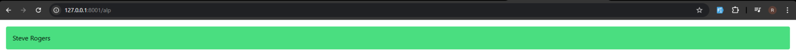
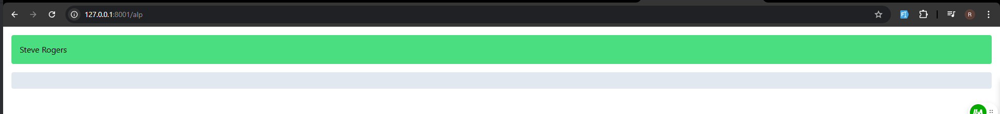
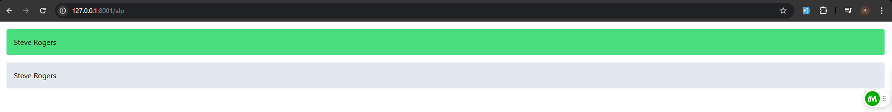

# Alpine JS
Alpine.js is a lightweight JavaScript framework designed for adding simple interactivity to web pages, especially in applications built with Laravel, Livewire, and Tailwind CSS. It provides reactive and declarative behavior using a minimal syntax, similar to Vue.js but without the need for a full build step.

# When to Use Alpine.js
- When you need simple interactivity (like toggling elements, modals, dropdowns).
- When using Laravel Livewire, since Alpine.js can handle minor UI interactions without requiring a full frontend framework.
- When building a project with Tailwind CSS for rapid styling and development.

# Example Usage

## Here's a simple example of Alpine.js in action:

```html

<div x-data="{ open: false }">
    <button @click="open = !open">Toggle</button>
    <p x-show="open">Hello, Alpine.js!</p>
</div>
```

# Getting Started with JavaScript
  Learn some JavaScript basics before diving into Alpine.js.

## Learn Basic JavaScript Concepts

### Variables: Store Data
```js
let name = "Aaran";
const age = 10;
```

### Data Types: Strings, Numbers, Booleans, Arrays, Objects
```js
let isStudent = true;
let colors = ["red", "blue", "green"];
let user = { name: "John", age: 25 };
```

### Functions: Code That Runs When Called
```js
function greet() {
    return "Hello, world!";
}
```

### Events: Actions Like Clicks, Keypresses, etc.
```js
document.querySelector("button").addEventListener("click", function() {
    alert("Button Clicked!");
});
```

## Practice JavaScript in the Browser Console
Open the browser, right-click → Inspect → Console. Try typing:
```js
console.log("Hello, JavaScript!");
```

## Understand How JavaScript Works with HTML
Example: A button that shows a message when clicked.
```html
<button onclick="alert('Hello!')">Click Me</button>
```

## Start Learning Alpine.js with Simple Examples
Once you're comfortable with basic JavaScript, you can try something like this:
```html
<div x-data="{ count: 0 }">
    <button @click="count++">Click me</button>
    <p>You clicked {{ count }} times</p>
</div>
```

# 1 Installation 

We can use Cdn in Header file or 

```bash
npm install alpinejs
```
then add this into app.js 

```
import Alpine from 'alpinejs'

window.Alpine = Alpine

Alpine.start();
```

# 2 Data 

## x-data

Everything in Alpine starts with the `x-data` directive.

x-data defines a chunk of HTML as an Alpine component and provides the reactive data for that component to reference

Imagine you have a light bulb in your room, and you want to turn it on and off with a button. We can use `x-data` to remember whether the light is on or off.

### Example Code:

```html
<div x-data="{ isOn: false }">
  <button x-on:click="isOn = !isOn">Toggle Light</button>
  <p x-text="isOn ? 'The light is on' : 'The light is off'"></p>
</div>
```
## Explanation:
- x-data="{ isOn: false }" starts by saying the light is off (isOn: false).
- When you click the button, x-on:click="isOn = !isOn" flips the state of the light. If it's on, it turns off; if it's off, it turns on.
- The paragraph `<p>` changes the text based on whether isOn is true or false: it shows "The light is on" or "The light is off."

### Example 2
```html
<div x-data="{name: 'Steve Rogers'}" class="bg-green-400 p-4 m-4 rounded">
    <span x-text="name"></span>
</div>
```


We can see the output.. 

Ithula Namma Enna Pannirukom naa, name ah x-data la key-value pair ah store panni athoda key ya x-text la kuduthu get pannirukom.. 

### Example 3
Ipo athuku keelaiye innoru vera div la antha key ah use panni value get panna mudiyuma nu try pannuvom..
```html
<div x-data="{name: 'Steve Rogers'}" class="bg-green-400 p-4 m-4 rounded">
    <span x-text="name"></span>
</div>

<!--div2-->
<div class="bg-slate-200 m-4 p-4 rounded">
    <span x-text="name"></span>
</div>
```

value va get panna mudila becoz.. `x-data` value va antha div kulla mattum than use panna mudiyum key-value pair ah use panni.. antha div ku veliya use panna mudiyathu..

### Example 4
```html
<div x-data="{name: 'Steve Rogers'}">
    
    <div class="bg-green-400 p-4 m-4 rounded">
        <span x-text="name"></span>
    </div>

    <div class="bg-slate-200 m-4 p-4 rounded">
        <span x-text="name"></span>
    </div>
    
</div>
```
intha mari oru Main div la pottu athuku , intha rendu div um kuduthaa.. Ipo rendukum name get Aagum..


# 3
## x-bind
x-bind is used to dynamically bind HTML attributes to data in Alpine.js.

## Example: Light Bulb ON/OFF

```html
<div x-data="{ isOn: false }">
    <button x-bind:class="isOn ? 'bg-yellow-500' : 'bg-gray-500'"
            x-on:click="isOn = !isOn">
        Click to Toggle Light
    </button>
</div>
```

## How This Works:
1️⃣ We start with `isOn: false` (the light is OFF).  
2️⃣ `x-bind:class="isOn ? 'bg-yellow-500' : 'bg-gray-500'"` changes the button’s color:  
   - If `isOn` is `true`, the button turns **yellow** (light is ON).  
   - If `isOn` is `false`, the button is **gray** (light is OFF).  
3️⃣ `x-on:click="isOn = !isOn"` flips `isOn` every time you click (turning the light on/off).  

## 🔥 What Happens When You Click?
- 💡 **First click** → Light turns ON (Yellow Button)  
- 💡 **Second click** → Light turns OFF (Gray Button)  
- 💡 **Third click** → Light turns ON again!  

It's just like flipping a real light switch! 🎉

### Why use x-bind?
It allows you to dynamically update attributes like src, class, disabled, etc., based on data changes.

## Example 2

```html
<div x-data="{
    selectedImageUrl: 'https://images.unsplash.com/photo-1737994872505-385ecc9a06e7?q=80&w=1374&auto=format&fit=crop&ixlib=rb-4.0.3&ixid=M3wxMjA3fDB8MHxwaG90by1wYWdlfHx8fGVufDB8fHx8fA%3D%3D',
    show: false,
    inputValue: 'Hello'
}">
    
    <input type="text" :value="inputValue" :style="{color: 'red'}">
</div>
```
Note: We can use x-bind shorthand `:` instead of using `x-bind` both are doing the same job.. 

# 4
## x-model 
In Alpine.js, `x-model` is a directive used to bind a value from the DOM element (such as an `input` or `textarea`) to a property in the Alpine component’s state and allows for `two-way data binding`. This means that when the value of the input changes, the corresponding property in the component’s state will automatically be updated, and vice versa.

Imagine you have a box (the input field) where you type something. And, there’s a piece of paper (a variable or a value) that you write down whatever you type in the box.

Now, `x-model` is like a magical link between the box and the piece of paper. When you type something in the box, it automatically writes that down on the piece of paper. And if you change the paper, the box will also change to match what's written on the paper.

> **Note** : So, in short, `x-model` keeps the box and the paper in sync, making sure that whatever you type in the box is always shown on the paper, and whatever is written on the paper will be shown in the box!

## Example 1

```html
<div x-data="{ name: '' }">
  <!-- Input box -->
  <input x-model="name" placeholder="Type your name">

  <!-- Display typed name -->
  <p>Your name is: <span x-text="name"></span></p>
</div>
```
### What’s happening here:

- We have a box where you can type your name (`<input>`).
- The x-model="name" connects the box to the name variable.
- Below, there's a paragraph (`<p>`) that shows the name you type in the box using x-text="name".
- 
So when you type in the input box, it will automatically show your name below it in real time!

## Example 2
```html
    <div x-data="{message: 'Hello World!'}">
        <input  x-model="message" type="text">
        <p x-text="message" class="m-2 p-2 bg-slate-200" ></p>
    </div>
```
if we make a change in input , it automatically reflects in `p` tag also, it happens in vice versa too.. 

> Note : 💡 Why use x-text? 
> It keeps the text updated in real time.
It’s safe because it only shows text (not weird code).
Alpine.js needs x-text because it doesn’t understand {{ name }} like some other tools.
So, think of x-text as a magic board that always updates to show what you type! 🪄✨

## Example 3
```html
<div class="hidden">
    bg-gray-500 bg-green-500 bg-blue-500 bg-red-500
</div>

<div class="max-w-md mx-auto space-y-2" x-data="{ myColor: 'gray' }">
    <div class="w-24 h-24 rounded" :class="'bg-' + myColor + '-500'"></div>
    <select x-model="myColor" >
        <option value="gray">Gray</option>
        <option value="green">Green</option>
        <option value="blue">Blue</option>
        <option value="red">Red</option>
    </select>
</div>
```
> Image : 

if u change the color in select option, it will dynamically change the color .. 

# 5 
## x-show and x-if 
#### What is x-show and x-if in Alpine.js?

`x-show` is an Alpine.js directive that controls whether an element is visible or hidden based on a condition. Unlike `x-if`, which removes the element from the DOM, `x-show` keeps the element in the DOM but hides it using CSS (`display: none`).

Imagine you have a box, and you want to decide when to show or hide things inside it. You can use a special rule to tell the box when to show something, and when to hide it.

- `x-show`: This is like saying, "Only show this thing when the rule is true." For example, if you want a box to be visible only when you have enough money, you can say, "Show the box if I have enough money." If the rule is not true, the box stays hidden, but it still exists in the background. You can change whether it's visible or not without losing the box itself.

- `x-if`: This is a bit like saying, "Only create this thing if the rule is true." If the rule is false, the box won't even be created! It's like building a toy only when you decide to play with it, and if you don't want to play, the toy doesn’t exist at all

##### So, in short:
- `x-show`: The element stays on the page, but it’s either visible or hidden.
- `x-if`: The element is only on the page if the rule is true; if it’s false, the element doesn’t even exist.

### Example 1

```html
<div x-data="{show: true}">
    <div x-show="show">This Element will be Shown or Hidden Based on the show value</div>
</div>
```
This will show that content "This Element will be Shown or Hidden Based on the show value"
if i change the value `false` instead of true that content will shown .. 

### Example 2

```html
<div x-data="{show: false}">
    <button @click="show = ! show" > Toggle </button>
    <div x-show="show">This Element will be Shown or Hidden Based on the show value</div>
</div>
```
In this example If i press Toogle Button that content will show .. Again if i press the Toggle That Content will Disappear

### Example 3

```html
<div x-data="{ show: false }">
    <!-- Button to toggle show -->
    <button @click="show = !show">Toggle Content</button>

    <!-- Content that will be added/removed based on the 'show' value -->
    <template x-if="show">
        <p>This content will be added when 'show' is true, and removed when it's false.</p>
    </template>
</div>
```
This is working similarly like `x-show`, but its working on condition based

> Note : The `<template>` tag is used in Alpine.js (and similar frameworks) to hold the content that will only be rendered when a condition is met, like with `x-if`.

### Example 4

```html
<div x-data="{showIfExample: false}">
    <button @click="showIfExample = ! showIfExample" > Toggle If </button>
    <template  x-if="showIfExample">
        <div>
            This Element will be Shown or Hidden Based on the show value
        </div>
    </template>
</div>
```
######  You can think its both works similarly .. but there’s a key difference between x-show and x-if that affects how they behave:

## Key Difference:
- `x-show`: The element is always on the page, but it's either visible or hidden using CSS (display: none). The element remains in the DOM even when it's hidden, meaning it's still loaded and part of the page structure, but you just can’t see it.

- `x-if`: The element is completely removed from the page when the condition is false. It doesn’t even exist in the DOM when the condition is not met. When the condition becomes true, the element is re-created.
- 
### Example for both

```html
<div x-data="{ show: false }">
    <!-- Button to toggle show -->
    <button @click="show = !show">Toggle Content</button>

    <!-- Using x-show -->
    <div x-show="show">
        This content is hidden or shown using CSS (display: none).
    </div>

    <!-- Using x-if -->
    <template x-if="show">
        <div>
            This content is completely removed and recreated when 'show' changes.
        </div>
    </template>
</div>
```
### What happens:
- When `show` is `false`:
  - The `x-show` content is still in the DOM but hidden.
  - The `x-if` content is not in the DOM at all.
  
- When `show` is true:
  - The `x-show` content becomes visible.
  - The `x-if` content is added to the DOM for the first time.

### In short:

- x-show: The element is always in the DOM, just hidden or shown using CSS.
- x-if: The element is completely added or removed from the DOM based on the condition.
So, `x-show` hides, but `x-if` creates or removes the element entirely.

> Note : Inspect that in Browser , you can see the Difference.

# 6 

## x-on,  x-ref  and  $refs

`x-on` is used in Alpine.js to add event listeners to elements. It's like saying, "When something happens, do this!"

For example, you can use `x-on` to listen for clicks, key presses, or other events and trigger actions in your JavaScript.

### Basic syntax:
```html
<button x-on:click="alert('Hello!')">Click me</button>
```
#### Explanation:

- `x-on:click="alert('Hello!')"` means: "When the button is clicked, show an alert that says 'Hello!'"

#### Other examples:
- `x-on:mouseover="doSomething()"`: Do something when the mouse is over the element.
- `x-on:keydown="handleKeyDown()"`: Call a function when a key is pressed.

#### Shorter version:
You can also write it like this using the shorthand:

```html
<button @click="alert('Hello!')">Click me</button>
````
It’s basically a way to say, "When this event happens, run this action!"

### Example 1

```html
 <section x-data>
    <button x-on:click="alert('Hello World')"> Say Hi </button>
</section>
```
when i press the Say Hi Button , it showa Hello World alert Message.

```html
<section x-data="{isOpen: false}">
<button @click="isOpen = ! isOpen"
    class="text-white bg-blue-700 hover:bg-blue-800 focus:ring-4 focus:outline-none focus:ring-blue-300 font-medium rounded-lg text-sm px-5 py-2.5 text-center inline-flex items-center dark:bg-blue-600 dark:hover:bg-blue-700 dark:focus:ring-blue-800" type="button">Dropdown button <svg class="w-2.5 h-2.5 ms-3" aria-hidden="true" xmlns="http://www.w3.org/2000/svg" fill="none" viewBox="0 0 10 6">
        <path stroke="currentColor" stroke-linecap="round" stroke-linejoin="round" stroke-width="2" d="m1 1 4 4 4-4"/>
    </svg>
</button>

<!-- Dropdown menu -->
<div @click.outside="isOpen = false" x-show="isOpen" id="dropdown" class="z-10 bg-white divide-y divide-gray-100 rounded-lg shadow-sm w-44 dark:bg-gray-700">
    <ul class="py-2 text-sm text-gray-700 dark:text-gray-200" aria-labelledby="dropdownDefaultButton">
        <li>
            <a href="#" class="block px-4 py-2 hover:bg-gray-100 dark:hover:bg-gray-600 dark:hover:text-white">Dashboard</a>
        </li>
        <li>
            <a href="#" class="block px-4 py-2 hover:bg-gray-100 dark:hover:bg-gray-600 dark:hover:text-white">Settings</a>
        </li>
        <li>
            <a href="#" class="block px-4 py-2 hover:bg-gray-100 dark:hover:bg-gray-600 dark:hover:text-white">Earnings</a>
        </li>
        <li>
            <a href="#" class="block px-4 py-2 hover:bg-gray-100 dark:hover:bg-gray-600 dark:hover:text-white">Sign out</a>
        </li>
    </ul>
</div>

</section>
```
> Note Copied this Tailwind Dropdown Code is from Flowbite

- First I Assign the x-data in section tag `x-data="{isOpen: false}"` (default false , because when i click it should only be work)
- Then If i Press the Dropdown Button I want to Open and close the Dropdown menu , so `<button @click="isOpen = ! isOpen"`
- `x-show="isOpen"`: This makes the dropdown visible when isOpen is true and hidden when isOpen is false.
- then what i want is when i click in the outside of the dropdown, that dropdown should be closed so - `@click.outside="isOpen = false"`

## x-ref and $refs

`x-ref` in combination with $refs is a useful utility for easily accessing DOM elements directly. It's most useful as a replacement for APIs like getElementById and querySelector.

### Example 1

```html
<div x-data >
    <button @click="$refs.text.remove()">Remove Text</button> <br />

    <span x-ref="text">Hello 👋</span>
</div>
```
If you click the Remove Text button , it removes Hello 

### Example 2

```html
<section x-data="{ maxLength: 100 }">
    <label for="message" class="block mb-2 text-sm font-medium text-gray-900 dark:text-white">Your message</label>
    <textarea x-ref="message" @keyup="maxLength = 100 - $refs.message.value.length" id="message" rows="4" class="block p-2.5 w-full text-sm text-gray-900 bg-gray-50 rounded-lg border border-gray-300 focus:ring-blue-500 focus:border-blue-500 dark:bg-gray-700 dark:border-gray-600 dark:placeholder-gray-400 dark:text-white dark:focus:ring-blue-500 dark:focus:border-blue-500" placeholder="Write your thoughts here..."></textarea>
    <span x-text="maxLength + 'Characters Remaining'"></span>
</section>
```

I copied this tailwind code from Flowbite.. 
- How it works 
    - When you type Something in that text area, it Reduce the Remaining Characters Dynamicallyy.. 
